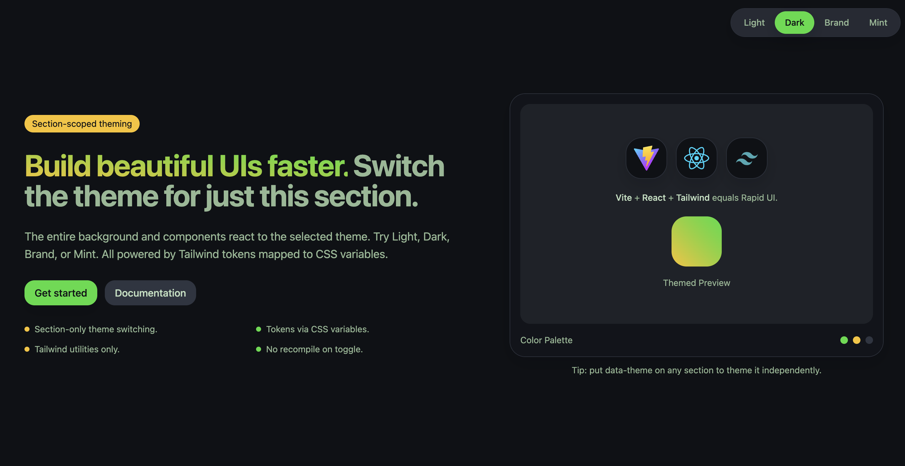
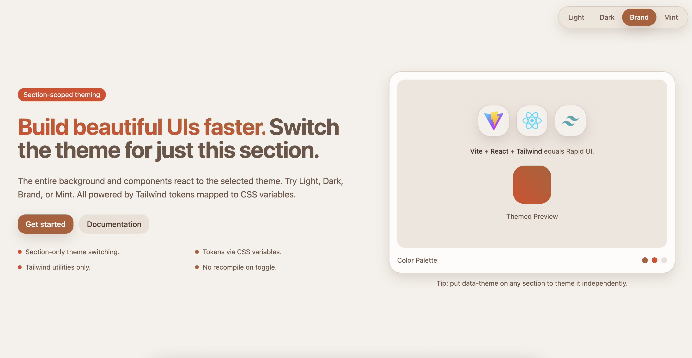
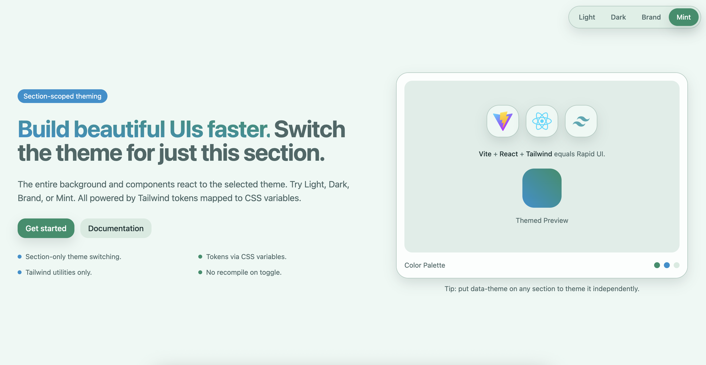

## Demo

[Demo: Vite + React + TypeScript + Tailwind]()

## Vite + React + TypeScript + Tailwind (Section-Scoped Themes)

A clean starter for real projects: Vite dev server, React 18 + TypeScript, Tailwind wired to CSS variables, ESLint + Prettier, and a polished Hero with a fixed theme switcher. Section-scoped theming lets you re-theme a single section without touching the rest of the page.

## Features

- Vite + React + TypeScript with Fast Refresh
- Tailwind CSS mapped to CSS variables (tokens) for instant theme switches
- Section-scoped theming via `data-theme="..."` (no global dark-mode hacks)
- Accessible, keyboard-friendly theme switcher (ArrowLeft / ArrowRight)
- Theme persistence with `localStorage`, system dark mode on first load
- Import alias `@` → `src` for clean paths
- ESLint + Prettier + Tailwind class sorting
- PostCSS + Autoprefixer for cross-browser CSS
- Production build: tiny, hashed, tree-shaken

## Preview

Here’s a preview of the **Vite + React + TypeScript + Tailwind**:






## Tutorial

Watch the step-by-step implementation of this project on my YouTube channel:
[https://www.youtube.com/@PixelPerfectLabs](https://www.youtube.com/@PixelPerfectLabs).


## Requirements

- Node.js 18 or newer
- npm (shown below; pnpm/yarn/bun also work)

## Quick Start

```bash
# 1) Scaffold (or use your existing folder)
npm create vite@latest my-app -- --template react-ts
cd my-app

# 2) Install template runtime deps
npm install

# 3) Install dev tooling (Tailwind, ESLint, Prettier, TS, Vite React plugin)
npm i -D tailwindcss postcss autoprefixer eslint @typescript-eslint/parser @typescript-eslint/eslint-plugin eslint-plugin-react eslint-plugin-react-hooks eslint-config-prettier prettier prettier-plugin-tailwindcss typescript@latest @types/react @types/react-dom @types/node @vitejs/plugin-react
```

## Project Structure

```
project-root/
├─ index.html
├─ postcss.config.js
├─ tailwind.config.ts
├─ vite.config.ts
├─ tsconfig.json
├─ eslint.config.js
├─ .prettierrc
├─ src/
│  ├─ vite-env.d.ts
│  ├─ styles/
│  │  └─ index.css
│  ├─ app/
│  │  └─ App.tsx
│  ├─ pages/
│  │  └─ home/
│  │     └─ Home.tsx
│  ├─ assets/
│  │  ├─ vite.svg
│  │  ├─ react.svg
│  │  └─ tailwind.svg
│  └─ main.tsx
└─ ...
```

## Create / Update Config Files

### postcss.config.js

```js
// postcss.config.js
export default {
  plugins: {
    tailwindcss: {},
    autoprefixer: {},
  },
};
```

### tailwind.config.ts

```ts
// tailwind.config.ts
import type { Config } from 'tailwindcss';

export default {
  content: ['./index.html', './src/**/*.{ts,tsx}'],
  theme: {
    container: {
      center: true,
      padding: '1rem',
      screens: { lg: '1024px', xl: '1200px', '2xl': '1400px' },
    },
    extend: {
      colors: {
        background: 'hsl(var(--background))',
        foreground: 'hsl(var(--foreground))',
        card: 'hsl(var(--card))',
        'card-foreground': 'hsl(var(--card-foreground))',
        muted: 'hsl(var(--muted))',
        'muted-foreground': 'hsl(var(--muted-foreground))',
        border: 'hsl(var(--border))',
        ring: 'hsl(var(--ring))',
        primary: {
          DEFAULT: 'hsl(var(--primary))',
          foreground: 'hsl(var(--primary-foreground))',
        },
        secondary: {
          DEFAULT: 'hsl(var(--secondary))',
          foreground: 'hsl(var(--secondary-foreground))',
        },
        accent: {
          DEFAULT: 'hsl(var(--accent))',
          foreground: 'hsl(var(--accent-foreground))',
        },
      },
      borderRadius: {
        xl: '1rem',
        '2xl': '1.5rem',
      },
      boxShadow: {
        soft: '0 10px 25px hsl(var(--shadow) / 0.15)',
      },
    },
  },
  plugins: [],
} satisfies Config;
```

### vite.config.ts

```ts
// vite.config.ts
import { defineConfig } from 'vite';
import react from '@vitejs/plugin-react';
import { fileURLToPath } from 'node:url';
import { dirname, resolve } from 'node:path';

const __filename = fileURLToPath(import.meta.url);
const __dirname = dirname(__filename);

export default defineConfig({
  plugins: [react()],
  resolve: {
    alias: { '@': resolve(__dirname, 'src') },
  },
});
```

### tsconfig.json

```json
{
  "compilerOptions": {
    "target": "ES2020",
    "module": "ESNext",
    "moduleResolution": "Bundler",
    "jsx": "react-jsx",
    "strict": true,
    "baseUrl": ".",
    "paths": { "@/*": ["src/*"] },
    "types": ["node", "vite/client"],
    "skipLibCheck": true,
    "useDefineForClassFields": true
  },
  "include": ["src", "vite.config.ts"]
}
```

### ESLint (pick ONE)

**ESLint 9 (flat config): `eslint.config.js`**

```js
// eslint.config.js
import js from '@eslint/js';
import globals from 'globals';
import reactHooks from 'eslint-plugin-react-hooks';
import reactRefresh from 'eslint-plugin-react-refresh';
import tseslint from 'typescript-eslint';
import { globalIgnores } from 'eslint/config';

export default tseslint.config([
  globalIgnores(['dist']),
  {
    files: ['**/*.{ts,tsx}'],
    extends: [
      js.configs.recommended,
      tseslint.configs.recommended,
      reactHooks.configs['recommended-latest'],
      reactRefresh.configs.vite,
    ],
    languageOptions: {
      ecmaVersion: 2020,
      globals: globals.browser,
    },
  },
]);
```

**ESLint 8 (classic): `.eslintrc.cjs`**

```js
// .eslintrc.cjs
module.exports = {
  root: true,
  parser: '@typescript-eslint/parser',
  plugins: ['@typescript-eslint', 'react', 'react-hooks'],
  extends: [
    'eslint:recommended',
    'plugin:react/recommended',
    'plugin:react-hooks/recommended',
    'plugin:@typescript-eslint/recommended',
    'prettier',
  ],
  settings: { react: { version: 'detect' } },
  rules: { 'react/react-in-jsx-scope': 'off' },
};
```

> Use flat config for ESLint 9. Use classic for ESLint 8. **Do not keep both.**

### .prettierrc

```json
{
  "singleQuote": true,
  "semi": true,
  "trailingComma": "all",
  "plugins": ["prettier-plugin-tailwindcss"]
}
```

## Global Types & Styles

### src/vite-env.d.ts

```ts
/// <reference types="vite/client" />

declare module '*.svg' {
  const src: string;
  export default src;
}
```

### src/styles/index.css

```css
@tailwind base;
@tailwind components;
@tailwind utilities;

/* Base: page uses tokens */
html, body, #root { height: 100% }
body {
  background: hsl(var(--background));
  color: hsl(var(--foreground));
}

/* Focus ring */
*:focus-visible {
  outline: 2px solid hsl(var(--ring));
  outline-offset: 2px;
}

/* Theme tokens — Light (default) */
:root,
[data-theme="light"] {
  --background: 0 0% 100%;
  --foreground: 222 31% 10%;

  --card: 0 0% 100%;
  --card-foreground: 222 31% 10%;

  --muted: 210 40% 96%;
  --muted-foreground: 222 11% 35%;

  --border: 214 32% 91%;
  --ring: 222 76% 52%;

  --primary: 222 76% 52%;
  --primary-foreground: 0 0% 100%;

  --secondary: 210 40% 96%;
  --secondary-foreground: 222 31% 15%;

  --accent: 262 83% 58%;
  --accent-foreground: 0 0% 100%;

  --shadow: 222 47% 11%;
}

/* Dark — high-contrast (shadcn-style) */
[data-theme="dark"] {
  --background: 240 10% 3.9%;
  --foreground: 0 0% 98%;

  --card: 240 10% 3.9%;
  --card-foreground: 0 0% 98%;

  --muted: 240 3.7% 15.9%;
  --muted-foreground: 240 5% 64.9%;

  --border: 240 3.7% 15.9%;
  --ring: 240 4.9% 83.9%;

  --primary: 0 0% 98%;
  --primary-foreground: 240 5.9% 10%;

  --secondary: 240 3.7% 15.9%;
  --secondary-foreground: 0 0% 98%;

  --accent: 240 3.7% 15.9%;
  --accent-foreground: 0 0% 98%;

  --shadow: 0 0% 0%;
}

/* Brand — warm oranges */
[data-theme="brand"] {
  --background: 30 33% 94%;
  --foreground: 23 32% 20%;

  --card: 0 0% 100%;
  --card-foreground: 23 32% 20%;

  --muted: 30 30% 90%;
  --muted-foreground: 23 22% 35%;

  --border: 28 30% 80%;
  --ring: 20 54% 45%;

  --primary: 20 54% 45%;
  --primary-foreground: 0 0% 100%;

  --secondary: 28 35% 88%;
  --secondary-foreground: 23 32% 25%;

  --accent: 12 72% 50%;
  --accent-foreground: 0 0% 100%;

  --shadow: 23 55% 20%;
}

/* Mint — fresh teals */
[data-theme="mint"] {
  --background: 160 45% 95%;
  --foreground: 180 30% 16%;

  --card: 0 0% 100%;
  --card-foreground: 180 30% 16%;

  --muted: 160 30% 90%;
  --muted-foreground: 180 16% 35%;

  --border: 160 22% 72%;
  --ring: 160 70% 38%;

  --primary: 160 60% 35%;
  --primary-foreground: 0 0% 100%;

  --secondary: 150 35% 88%;
  --secondary-foreground: 180 30% 16%;

  --accent: 200 80% 45%;
  --accent-foreground: 0 0% 100%;

  --shadow: 180 25% 18%;
}

/* Reusable components */
@layer components {
  .btn {
    @apply inline-flex items-center justify-center gap-2 rounded-2xl px-4 py-2 font-semibold transition;
  }
  .btn-primary {
    @apply bg-primary text-primary-foreground shadow-soft hover:brightness-95;
  }
  .btn-secondary {
    @apply bg-secondary text-secondary-foreground hover:brightness-95;
  }
  .badge {
    @apply inline-flex items-center rounded-full bg-accent px-3 py-1 text-sm font-semibold text-accent-foreground;
  }
}
```

## App Shell

- `src/app/App.tsx` keeps the app minimal (rendering `Home` and hosting future providers like Router or QueryClient).
- `src/pages/home/Home.tsx` implements the themed Hero, the fixed switcher, keyboard support, and small animations.
- `src/main.tsx` imports global styles and mounts `<App />`.

> Tip: To theme a section, set `data-theme` on that section. Everything inside uses the mapped Tailwind tokens automatically.

## package.json (essentials)

```json
{
  "name": "my-app",
  "private": true,
  "version": "0.0.0",
  "type": "module",
  "scripts": {
    "dev": "vite",
    "build": "vite build",
    "preview": "vite preview",
    "lint": "eslint \"src/**/*.{ts,tsx}\"",
    "format": "prettier --write .",
    "format:check": "prettier --check ."
  },
  "dependencies": {
    "react": "^18.3.1",
    "react-dom": "^18.3.1",
    "vite": "^5.4.2"
  },
  "devDependencies": {
    "@types/node": "^22.0.0",
    "@types/react": "^18.3.3",
    "@types/react-dom": "^18.3.0",
    "@vitejs/plugin-react": "^4.3.1",
    "autoprefixer": "^10.4.20",
    "eslint": "^9.9.0",
    "eslint-config-prettier": "^9.1.0",
    "eslint-plugin-react": "^7.35.0",
    "eslint-plugin-react-hooks": "^5.1.0-rc.0",
    "postcss": "^8.4.41",
    "prettier": "^3.3.3",
    "prettier-plugin-tailwindcss": "^0.6.8",
    "tailwindcss": "^3.4.10",
    "typescript": "^5.5.4"
  }
}
```

> If something’s missing, add it here and run `npm install` again.

## Run, Build, Preview

```bash
# Dev server
npm run dev

# Production build
npm run build

# Preview the production build locally
npm run preview
```

## Accessibility Notes

- Theme switcher uses `role="tablist"` / `role="tab"` and `aria-selected`
- Keyboard navigation: ArrowLeft / ArrowRight to change themes
- Focus outlines use the theme’s `--ring` color

## Troubleshooting

- **`Option 'bundler' can only be used when 'module' is 'es2015' or later`**
  Update TypeScript: `npm i -D typescript@latest` and ensure `"module": "ESNext"`.

- **`Cannot find name '__dirname'` in vite.config.ts**
  Use ESM-safe version shown above with `fileURLToPath` / `dirname`.

- **`Cannot find module 'node:url' types`**
  Ensure `@types/node` is installed and `"types": ["node", "vite/client"]` are in `tsconfig.json`.

- **Tailwind classes not applying**
  Ensure `src/styles/index.css` is imported once in `src/main.tsx` and `content` globs are correct in `tailwind.config.ts`.
